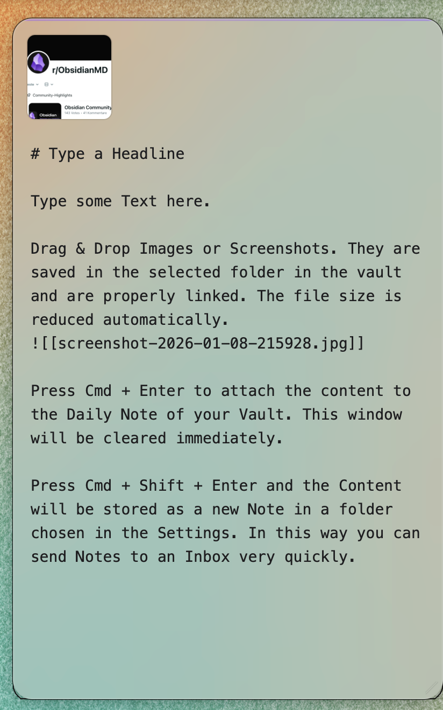
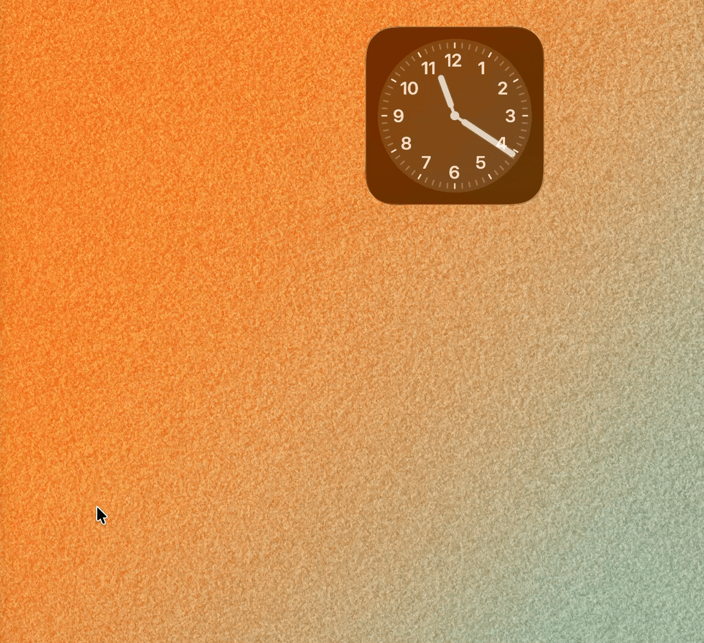

# Collector — Obsidian Quick Capture for macOS
License: MIT

I build a macOS  app for quick text and image capture into Obsidian. Without opening the software!


---

## Features

- **Edge Detection**  
  Move your mouse to the screen edge to instantly open the capture window

- **Global Shortcut**  
  Configurable system-wide hotkey (default: `⌘⇧N`)

- **Drag & Drop**  
  Drop screenshots or images directly into the capture window (Images are automatically compressed)

- **Direct Obsidian Integration**  
  Writes straight into your Daily Note or creates a new note — Obsidian doesn't need to be open, it stays in the background

- **Background App**  
  Runs quietly in the menu bar

## Planned for 1.1
- Multi-Vault Support
- Dark/Light Mode auto-switching
- Multiple Templates for different note types
- Fixing the ugly corner bug at the bottom!

---

## Requirements

- macOS **11.0 (Big Sur)** or newer
- **Apple Silicon (M1/M2/M3/M4)**  (Intel Mac is work in progress!)
- Obsidian installed

---



---

## Installation

### Download

**[Direct Download](https://github.com/juliandeans/Collector/releases/latest/download/Collector_aarch64.app.tar.gz)** | [View All Releases](https://github.com/juliandeans/Collector/releases)

1. Go to **GitHub → Releases**
2. Download the latest `.dmg` file  
   - `aarch64` → Apple Silicon (M1/M2/M3/M4)

### Install

1. Open the `.dmg`
2. Drag **Collector** into the **Applications** folder
3. Launch the app

---



---

## ⚠️ macOS Security (First Launch)

Because this app is not code-signed or notarized (no Apple Developer account),
macOS will initially block it. This is normal for open-source tools.

**To open the app:**

1. **Recommended**: Right-click → **Collector** → Click **Open** → Confirm
2. **Alternative**: System Settings → Privacy & Security → Click **Open Anyway**
3. **Terminal** (last resort):
```bash
   xattr -dr com.apple.quarantine /Applications/Collector.app
```

You only need to do this **once**. After that, the app opens normally.

## Permissions
Accessibility (required)
Collector needs Accessibility access for global shortcuts.

Open System Settings

Go to Privacy & Security → Accessibility

Unlock the settings

Enable Collector

Restart the app

## Configuration
Open Menu Bar Icon → Settings…

### Core Settings
Path Variables
You can use these variables in paths and filenames:

YYYY — year

MM — month

DD — day

HH — hour

mm — minute

ss — second

### Capture Screenshots
Take a screenshot (Cmd+Shift+4). Drag the floating thumbnail to the screen edge. The capture window opens automatically. Image is compressed and inserted in your Vault.

### Standard Keyboard Shortcuts
Shortcut	Action
Cmd + Enter -	Save to Daily Note
Shift + Cmd + Enter - Create a new note 
Esc	- Close without saving

## Troubleshooting
### Vault not found
Vault name must exactly match Obsidian
Vault must contain an obsidian folder
Ensure Collector has read/write access

### Global shortcut does not work
Check Accessibility permission
Restart Collector
Try a different shortcut (may be in use)

### Images are not saved
Check image folder path in settings
Ensure write permissions
Folder is created automatically if missing

### Daily Note not created
Path format must be valid
Use right-click → Open
Check System Settings → Privacy & Security

## 🛠️ Development

Want to contribute? Here's how to get started.

### Requirements

- **Node.js** 18+
- **Rust** 1.70+
- **Xcode Command Line Tools**

### Setup
```bash
git clone https://github.com/YOUR-USERNAME/Collector.git
cd Collector
npm install
```

### Development Mode
```bash
npm run tauri dev
```

### Production Build
```bash
npm run tauri build
# Output: src-tauri/target/release/bundle/
```

### Generate Icons
```bash
npm run tauri icon path/to/icon.png
```

### Project Structure
```
collector/
├── src/              # Svelte frontend
├── src-tauri/        # Rust backend (Tauri)
├── package.json
└── vite.config.js
```


## Legal

Collector is licensed under the MIT License.

"Obsidian" is a trademark of Dynalist Inc. This project is not affiliated with, 
endorsed by, or sponsored by Dynalist Inc.

## Tech stack
Tauri
Rust
Svelte
