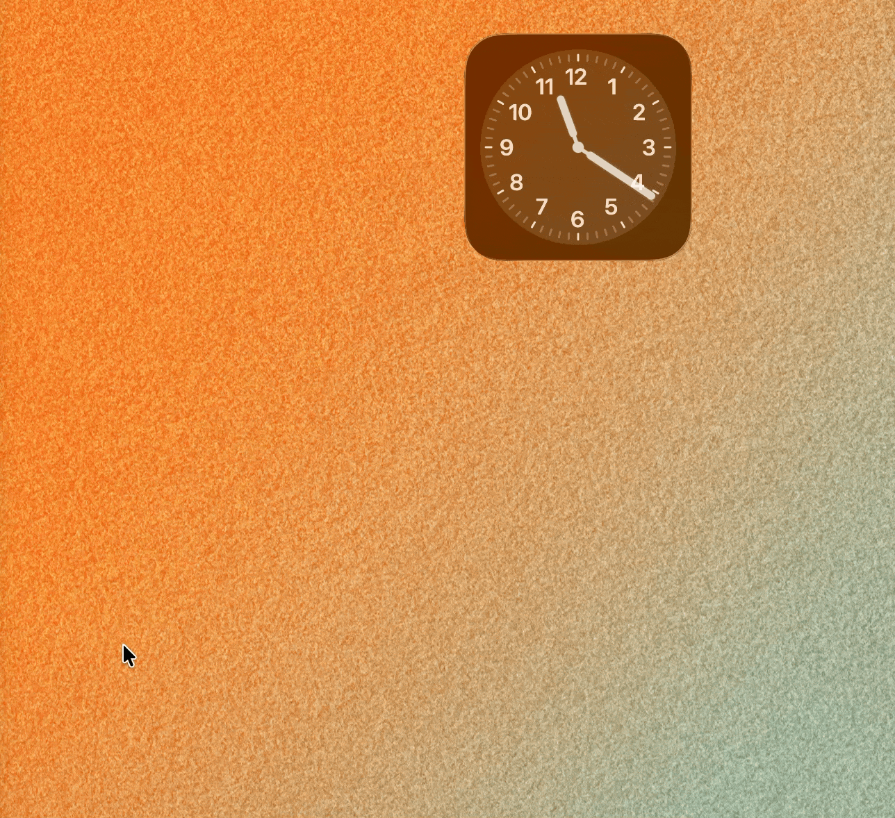
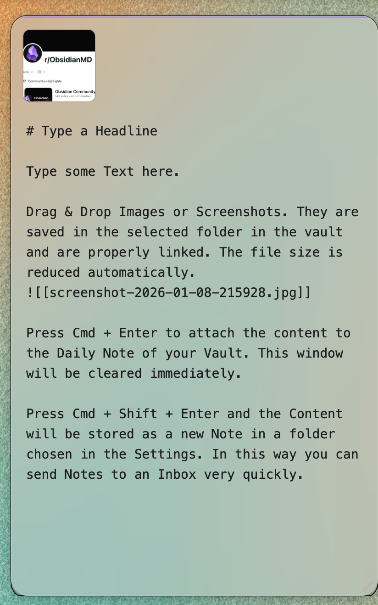
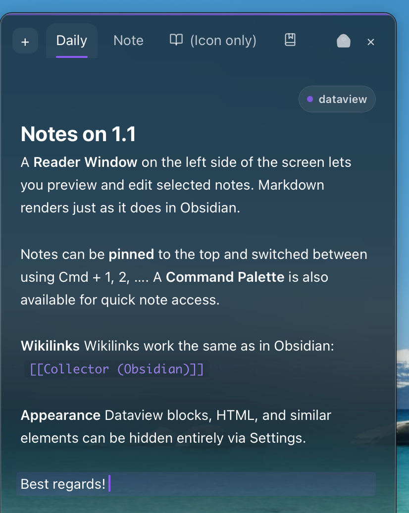

# Collector - Obsidian Quick Capture for macOS

Collector is a macOS menu bar app for fast text and image capture into Obsidian. It lets you save notes, screenshots, and pasted content into your vault without opening the full Obsidian app first.


## Features

- Edge activation: move the cursor to a screen edge to open the capture window instantly
- Global shortcut: configurable system-wide hotkey, default `Cmd+Shift+N`
- Quick capture: append to the Daily Note or save a new note directly into your vault
- Drag and drop images: drop screenshots or images into the capture window and compress them automatically
- Menu bar app: runs quietly in the background and stays one shortcut away



## Reader Panel in v1.1

- Tab-based reader: keep the Daily Note open, pin notes from settings, and open extra notes on demand
- Hybrid Markdown editing: rendered reading view with raw Markdown editing on the active line
- Image rendering: inline support for `![[image.png]]` and standard Markdown image links
- Wikilink navigation: open `[[Note Links]]` in the current tab or a new tab with `Cmd+Click`
- Open in Obsidian: jump from the Reader straight into the current note in Obsidian
- Command palette: open any vault note with `Cmd+P` or `Cmd+K`
- Wikilink autocomplete: inline `[[` completion while typing
- Inline search: find and step through matches in the current note with `Cmd+F`
- Content filters: optionally hide frontmatter, Dataview blocks, inline fields, HTML, and Obsidian comments
- Reader image import: drop or paste images directly into the Reader using the same compression settings as the capture window

### Additions and Fixes in 1.1.1
**Fixes**
- Daily note folder paths now support date placeholders (e.g. Journal/YYYY/MM)
- Screenshot previews now display correctly in the capture window
- Reader text color now applies consistently to all elements including headings and callouts
- Drag overlay in the Reader no longer gets stuck

**New**
- Note filename template is now configurable in Settings
- Option to hide callouts in the Reader 
- Dual monitor support: edge detection and window positioning now work correctly across all monitors

## Settings

- Separate window sizing for the capture window and Reader window
- Custom colors for accents, internal links, and external links
- Adjustable glass effect, transparency, blur, and brightness
- Edge activation controls including cooldown, modifier keys, and excluded apps
- Configurable note paths, templates, image folder, and compression limit

## Requirements

- macOS 11.0 (Big Sur) or newer
- Apple Silicon Mac
- Obsidian installed


## Installation

### Download

**[Direct Download](https://github.com/juliandeans/Collector/releases/latest/download/Collector_aarch64.app.tar.gz)**  
[View All Releases](https://github.com/juliandeans/Collector/releases)

1. Open the GitHub Releases page
2. Download the latest `.dmg` or archive for Apple Silicon
3. Open the installer and move Collector into `Applications`

## Note Window


## Reader Window


## macOS Security on First Launch

Because the app is currently not code-signed or notarized, macOS may block it the first time. That is expected for an open-source desktop app.

To open the app:

1. Recommended: right-click the app and choose `Open`
2. Alternative: go to `System Settings > Privacy & Security` and click `Open Anyway`
3. Terminal fallback:

```bash
xattr -dr com.apple.quarantine /Applications/Collector.app
```

You only need to do this once.

## Permissions

Collector needs Accessibility access for global shortcuts.

1. Open `System Settings`
2. Go to `Privacy & Security > Accessibility`
3. Unlock the settings
4. Enable Collector
5. Restart the app

## Configuration

Open the menu bar icon and choose `Settings...`.

### Path Variables

These placeholders can be used in paths and file names:

- `YYYY` - year
- `MM` - month
- `DD` - day
- `HH` - hour
- `mm` - minute
- `ss` - second

### Capture Screenshots

Take a screenshot with `Cmd+Shift+4` and drag the floating thumbnail to the configured screen edge. Collector opens, compresses the image, and inserts it into your vault.

### Default Shortcuts

| Shortcut | Action |
| --- | --- |
| `Cmd+Enter` | Save to Daily Note |
| `Shift+Cmd+Enter` | Save as a new note |
| `Esc` | Close without saving |
| `Cmd+F` | Search inside the Reader |
| `Cmd+P` / `Cmd+K` | Open the Reader command palette |

## Troubleshooting

### Vault not found

- Make sure the vault name exactly matches the one in Obsidian
- Make sure the vault contains an `.obsidian` folder
- Make sure Collector has read and write access

### Global shortcut does not work

- Check Accessibility permission
- Restart Collector
- Try a different shortcut if the current one is already in use

### Images are not saved

- Check the image folder path in settings
- Make sure the vault is writable
- The target folder is created automatically if it does not exist

### Daily Note is not created

- Make sure the configured path format is valid
- Check vault permissions in `System Settings > Privacy & Security`

## Development

### Requirements

- Node.js 18+
- Rust 1.70+
- Xcode Command Line Tools

### Setup

```bash
git clone https://github.com/YOUR-USERNAME/Collector.git
cd Collector
npm install
```

### Development Mode

```bash
npm run tauri dev
```

### Production Build

```bash
npm run tauri build
```

The macOS app bundle is created in `src-tauri/target/release/bundle/`.

### Project Structure

```text
collector/
|-- src/              # Svelte frontend
|-- src-tauri/        # Rust backend and Tauri setup
|-- public/           # Static assets
|-- package.json
`-- vite.config.js
```

## Legal

Collector is licensed under the MIT License.

Obsidian is a trademark of Dynalist Inc. This project is not affiliated with, endorsed by, or sponsored by Dynalist Inc.
